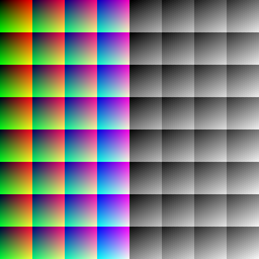

# Sega 315-5242 module

Thanks to @Caius for donating a module.

The 315-5242 is a video DAC including a custom chip, a triple DAC made of printed resistors and 3 output transistors.

The chip is an OKI M71064 gate array (fully digital). Its main purpose is to synchronize the input color bits with the pixel clock and gate the outputs depending on the blanking signal.

It can also convert the color input to greyscale. This is the more complex part of the chip as the conversion is peformed only in logic, there's no ROM lookup table involved.

Lastly, control inputs allow the output to be darkened or highlighted.

*Normal: shading outputs are tri-stated so they don't affect the final voltage.
*Shadow: shading outputs are active and set to low if the color component is non-zero.
*Highlight: shading outputs are active and set to high if the color component is non-zero.

This means that shading is disabled when the output is pure black.

# Pinout

See `M71064.ods`

# Schematic

See `M71064.png`

The schematic was traced from the chip's silicon and should represent exactly how it is internally constructed.

# Verilog

See `M71064.v` (only tested in simulation).
